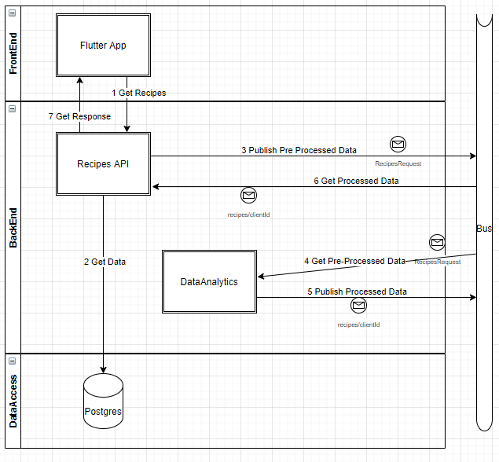

# Chapter 2: Preparation

!!! abstract "Abstract"
    This chapter covers the preparation in terms of the approach and architecture defined for the solution, as well as the setup of the development environment. (**5 min read**)

## Approach

<!-- Document the approach taken to develop the solution based on the defined requirements and knowledge about the project -->

Based on the available data, the decision was to start with a simple approach of basic scoring, in order to accelerate integration and collect early feedback to justify the need for a more complex approach

!!! tip
    Following the [KISS principle](https://en.wikipedia.org/wiki/KISS_principle), it is suggested to always start with a very simple approach (even if it is not Machine Learning), and once it is implemented you can collect feedback and data about usage and then refine it.

### Assumptions

This approach was elaborated taken into account these restrictions and considerations

- This approach is intended for a ["cold start"](https://medium.com/yusp/the-cold-start-problem-for-recommender-systems-89a76505a7), where no users history is available
    - Therefore, recommendations are obtained only based on the recipes information, not from users

- Assuming that available recipes are received from input

### Idea
In this "naive" approach, the idea is to get the recipes with best score based on the following aspects:

- Matching of ingredients entered
- Ratings of recipes
- Cooking time required

By tuning the score functions of these aspects, as well as the way to aggregate them, we could have a very quick way to select the best recipes to recommend, in order to be able to start the integration with other services and then have the structure needed to try a better approach.

### Metrics
In order to assess if a set of recommended recipes is appropriate for a set of entered ingredients, these are the aspects to be evaluated:

- Quality of matched ingredients, by checking average matching ratio of ingredients > 0.5 
- Popularity of recipes, by checking average rating > 4.0
- Complexity of recipes, by checking average cooking time < 60

More details about approach in [this Jupyter notebook](https://github.com/Matech-Studios/starvapp_recipes_recommender/blob/main/notebooks/20201228_basic_approach_scores.ipynb).

## Architecture

<!-- Describe the architecture of the solution, including diagrams and proper details to understand the workflows at high level -->

The solution must be integrated with the rest of the application by interacting with the backend through a proper bus. Therefore, this is the general architecture that the service had to meet to allow the integration. 

These are the steps that the application takes in the normal flow:

1. The **App** registers the input of the user and requests recipes to the **Recipes API**.
2. The **Recipes API** gets data from the Database and do the pre-processing of the data to prepare it for the **Data Analytics** service.
3. The **Recipes API** publishes the pre-processed data to the *Events Bus* and waits for the recommended recipes that the **Data Analitycs** will return by subscribing to a configured topic of the bus (e.g. `recipes/{clientId}`).
4. The **Data Analitycs** is subscribed to the configured topic of the *Event Bus* and gets the pre-processed data published by the **Recipes API**.
5. The **Data Analitycs** processes the data to get a set of recommended recipes, and publishes the selected recipes to the *Event Bus* on the same configured topic.
6. The **Recipes API** gets the data with the recommended recipes from the *Events Bus*.
7. The **Recipes API** returns the response to the **App**.

It is important to highlight that if this process from step 4 to 6 takes more than a configured window in seconds, the **Recipes API** will return a default response to the **App** which is just a header of the recipes retrieved in the step 2.

## Setup

<!-- Describe all the needed steps to setup a proper development environment -->

#### Code Repository

At this moment of the project, we didn't have a proper scaffolding nor boilerplate to setup the code repository. Therefore, a new repository was started from scratch, taking into account:

- Repository name following the name convention followed in Matech, so it was named `Matech.Starvapp.RecipesRecomender.Analytics`.
- A Python package to develop the actual logic to process the data
- A folder with the script for the service
- A folder to place the notebooks intended for exploration and checks
- A folder to develop the tests for the solution at *unit* and *system* level
- A folder for development tools (e.g. run linter, set environment, run tests)

The repository was published [here](https://github.com/Matech-Studios/Matech.Starvapp.RecipesRecomender.Analytics). You can check how the initial structure was defined in [this Pull Request](https://github.com/Matech-Studios/Matech.Starvapp.RecipesRecomender.Analytics/pull/1), obtaining this:

      ├── README.md              <- The top-level README for developers using this project
      │      
      ├── starvapprecom          <- Core package of this project.
      │   ├── approaches         <- Module to develop approaches for recipes recommendations                           
      │   ├── scrapers           <- Module to handle scrapers of recipes      
      │   └── utils              <- Module to provide utils in general       
      │                
      ├── data                   <- Folder for datasets to be used locally  
      │
      ├── docs                   <- Project documentation and resources  
      │
      ├── notebooks              <- Place to store all Jupyter notebooks  
      │
      ├── scripts                <- Scripts to execute services and other functions  
      │                
      ├── tests                  <- Unit and System tests of the core library  
      │
      ├── tools                  <- Tools for the development of this project  
      │
      └─── requirements.txt      <- File that specifies the dependencies for this project

#### Environment

All the services in StarvApp are deployed through [Kubernetes](https://kubernetes.io/es/docs/concepts/overview/what-is-kubernetes/), so each of them must provide a `Dockerfile` that allows the DevOps team to achieve the actual deployment. Therefore, for this repository we provided:

- A `Dockerfile` that creates and serves the recommender solution
- A `Dockerfile_rabbitmq` that creates a RabbitMQ server for testing purposes
- A `docker-compose.yml` to configure the connection between these two previous services, for testing purposes.

In addition, to allow an easy way to make local development, there are tools to create and use a [virtualenv](https://pypi.org/project/virtualenv/) which is easier to handle for local tests.

You can check both configurations in the actual code repository.

#### Continuous Integration

The StarvApp has a Continuous Integration (CI) pipeline configured and handled by the DevOps team, so the CI is already managed in this work and the files explained in the Environment section are the contract to ensure correct integration. However, additionally a Github Actions workflow was configured for this repository to make the following checks:

- Smoke testing based on configured tests 
- Code coverage along the releases
- Correct linting  

You can check the configuration and current status in the project's README.

